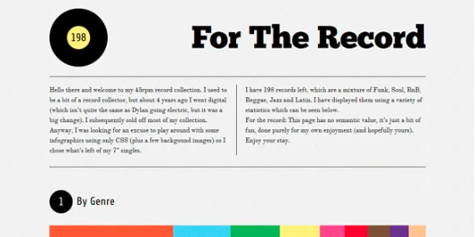
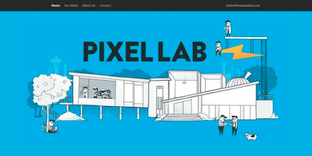

# (1) First mini-project for the check html and css level.

Create files index.html and style.css or make OnePage style webpage in React/Angular/Vue....

- If you made web page with help any framework or library like React/Vue etc. then when reviewing the code we only check the part of html and css responsible the web page.
  Some ideas for web pages:
- Site with example https://www.intechnic.com/blog/60-beautiful-examples-of-one-page-website-design-inspirations/

